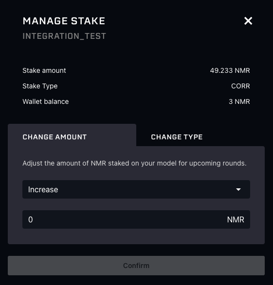
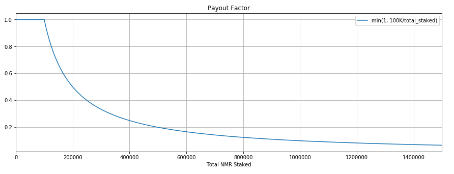
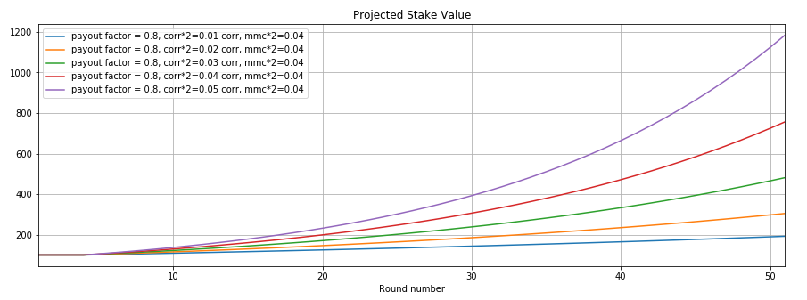

# Numerai Signalsについての概要

[Numerai Signals](https://signals.numer.ai/tournament) は、全世界の株式市場を対象としたコンペティションです。 
収益の源泉となる指標を用いたシグナルを作成し、他の人のシグナルと比較してオリジナリティがどれだけ高いか比較することができます。 
より独創的で、優位な予測データを提出すると、ステーク量に比例したNMRトークンを得ることができます。 
また、Numeraiのヘッジファンドではオリジナリティが最も高いシグナルを使用しています。 

Numerai Signals は、Numeraiヘッジファンドを構築するために使用され、Numeraiのマスタープランの一部です。 
[Medium Post](https://medium.com/numerai/building-the-last-hedge-fund-introducing-numerai-signals-12de26dfa69c) や、[short film](https://www.youtube.com/watch?v=GWeC2PK4yXQ&feature=youtu.be) で詳細が述べられています。

## 概要

1. [Numerai Signals](https://signals.numer.ai/tournament)にサインアップするか、既存のNumerai Tournament アカウントでサインインしてください。
2. 対象となっている株式市場に対応したシグナルをアップロードすると、過去のパフォーマンス、リスク、収益性の診断ができます。
3. 現行のコンペティションにNMRをステーキングすると、性能（Corr,MMC)に基づいてNMRを得られます。ただし、品質の低いシグナルではNMRを失うこともあります。
4. NumeraiのAPIに直接接続することで、毎週のシグナル提出を自動化することができます。

## 株式市場のシグナルとは?

株式市場のシグナルとは、Numeraiのようなクオンツ・ファンドがポートフォリオを構築するために使用するデータのことです。

株式市場のシグナルの例としては、次のようなものがあります。

* [ファンダメンタルシグナル](https://www.investopedia.com/terms/f/fundamentalanalysis.asp) \([P/E ratio](https://www.investopedia.com/terms/p/price-earningsratio.asp), [dividend yield](https://www.investopedia.com/terms/d/dividendyield.asp), [analyst ratings](https://www.investopedia.com/terms/r/rating.asp#:~:text=A%20rating%20is%20conducted%20by,this%20action%20for%20the%20stock.)\)
* [テクニカルシグナル](https://www.investopedia.com/terms/t/technicalindicator.asp) \([MACD](https://www.investopedia.com/terms/m/macd.asp), [RSI](https://www.investopedia.com/terms/r/rsi.asp), [MFI](https://www.investopedia.com/terms/m/mfi.asp)\)
* [オルタナティヴデータシグナル](https://en.wikipedia.org/wiki/Alternative_data_%28finance%29) \([クレジットカード取引](https://secondmeasure.com/), [衛生画像](https://www.theatlantic.com/magazine/archive/2019/05/stock-value-satellite-images-investing/586009/), [ソーシャルメディアの感情](https://www.swaggystocks.com/dashboard/wallstreetbets/realtime)\)
* [ブレンドシグナル](https://www.investopedia.com/terms/m/multifactor-model.asp) \([Barra risk factors](https://www.investopedia.com/terms/b/barra-risk-factor-analysis.asp#:~:text=The%20Barra%20Risk%20Factor%20Analysis%20is%20a%20multi%2Dfactor%20model,turnover%20and%20senior%20debt%20rating.), [Fama French factors](https://www.investopedia.com/terms/f/famaandfrenchthreefactormodel.asp)\)

これらのシグナルを生成するために使用される基礎データは、異なったフォーマットをもつ可能性が高いです。 
例えば、監査済みの財務報告書と駐車場の画像は全く異なるデータですが、明日の株式市場を予測する指標が含まれているかもしれません。 
Numeraiが参加者のデータを利用するためには、規格化が必要です。参加者はティッカーとシグナルデータが一対一で対応するようなリストを作成する必要があります。 

## シグナルの作り方

### データとツール

独自のシグナルを作成するためには、まず、いくつかの株式市場のデータを取得する必要があります。


株式市場のデータをもっていないデータサイエンティストですか？代わりに[Numerai Tournament](https://numer.ai/)に参加してください。 


まだ株式市場のデータにアクセスできていない場合は、 [Yahoo Finance](https://finance.yahoo.com/)、[Quandl](https://www.quandl.com/)、 [Koyfin](https://www.koyfin.com/) など、インターネット上に無料または格安のデータプロバイダーが多数存在します。 

また、 [Quantopian](https://www.quantopian.com/)、[QuantConnect](https://www.quantconnect.com/)、[Alpaca](https://alpaca.markets/) などのシグナルを簡単に作成できるプラットフォームもあります。特に、[Risk Model](https://www.quantopian.com/risk-model) と[AlphaLens Tearsheets](https://www.quantopian.com/tutorials/alphalens#lesson1) は、シグナルの品質を分析するのに最適な方法です。 私たちのコミュニティで使用されている人気のあるデータソース、プラットフォーム、ツールのリストについては、この[forum thread](https://forum.numer.ai/t/free-or-cheap-data-for-erasure-numerai-quant/350) をチェックしてください。


ユニークで差別化されたデータセットを見つけることが、オリジナルのシグナルを生み出す鍵となります。


### ユニバース（＊対象とする株式市場）

ユニバースは世界の上位5000の大型株を含んでいます。 

ユニバースは毎週更新されますが、更新対象となるのは出来高の少ない数銘柄のみです。 

[latest universe file](https://numerai-signals-public-data.s3-us-west-2.amazonaws.com/universe/latest.csv) をダウンロードすると、最新のユニバースを見ることができます。

ユニバースの履歴は、 [historical targets file](https://numerai-signals-public-data.s3-us-west-2.amazonaws.com/signals_train_val_bbg.csv) をダウンロードしてご覧いただけます。

### データの提出

作成したデータをNumerai Signals に提出する際は、少なくとも2つの列を含める必要があります。 

* `cusip`、`sedol`、または`bloomberg_ticker` 列 - 値はヘッダーのticker タイプに関連付けられた有効なティッカーでなければなりません。 
* `signal` 列- 値は0から1の間でなければなりません（排他的）。 

さらに、有効な提出をするためには：  
* 現在の期間の予測を含む行が少なくとも10行ある必要があります。 
* 同じティッカーを複数回使用することはできません。 

2列のみの予測結果は、現在の`live`時間帯に対応していると仮定します。 

また、シグナルを提出すると過去のパフォーマンス、リスク、潜在的な収益に関する診断もできます。検証期間は`20130104`から`20200228`までの374週間です。 

検証期間を含む予測結果には、friday_date,data_type列を含める必要があります。

* `friday_date` 列 -  Numerai Signals では、コンペティションの開始が金曜日なので、金曜日に相当する日付をいれる必要があります。
* `data_type`  列 - 値は`live`または`validation`のみを取り得ます。`data_type`が`live`の行には、直近の金曜日の日付が含まれていなければなりません。

最新の提出例は[こちら](https://numerai-signals-public-data.s3-us-west-2.amazonaws.com/example_signal/latest.csv)からダウンロードできます。

### 診断

シグナルを提出すると、過去のパフォーマンス、リスク、潜在的な収益の診断ができます。これは通常、提出物に含まれている週数やティッカー数に応じて10～15分程度かかります。 

これらの診断を用いると、NMRをステークする価値があるかを評価できます。ただし、過去の検証期間中に高いパフォーマンスが出たシグナルは、現在または将来のライブ期間で良いスコアが得られない可能性があることに注意すべきです。 


この診断ツールを繰り返し使用すると、すぐにオーバーフィッティングにつながります。診断は、シグナル作成プロセスの最終チェックとしてのみ使用してください。


診断の計算に使用した過去のターゲットはすべて[ここ](https://numerai-signals-public-data.s3-us-west-2.amazonaws.com/signals_train_val_bbg.csv)にあります。

### 提出フローの自動化


最新のシグナルを毎週Numeraiに提出する必要があります。


[Numerai-CLI](https://github.com/numerai/numerai-cli)、[GraphQL API ](https://api-tournament.numer.ai/)、公式 python クライアントを使用することで、投稿ワークフローを自動化することができます。



## シグナルの評価方法

### 中和

Numeraiは様々な既存のデータをもっています。既存のシグナルには、Barra ファクター（サイズ、バリュー、モメンタムなどのようなもの）、国やセクターのリスクファクター、custom stock features などが含まれています。


定義: シグナルまたはターゲットは、Barra ファクター、国やセクターのファクター、その他のcustom stock features など、Numeraiの既存のシグナルとの相関関係が０になるように変換された後、"中和" されたとみなされます。


Numerai Signalsにアップロードされた全てのシグナルは、スコアリングされる前に中和されます。中和のポイントは、既知のシグナルに存在しないシグナルの独自成分あるいは直交成分を分離することです。


よく知られたいくつかのシグナルの単純な線形和を提出すると、中和後に直交成分がほとんど残りません。


シグナルを評価するために使用されるターゲットも中和されます。ターゲットは、実質的にはNumerai のカスタムの「特定のリターン」または「残留リターン」です。 

中和を実行するために使用されるデータは提供されないため、このプロセスは「ブラックボックス」であることを意味します。 
ただし、過去の期間に強いスコアを持つシグナルは、現在のラウンドでも将来のラウンドでも良いスコアが得られない可能性があることに注意すべきです。 
シグナルのヒストリカル診断を使用して、中和が将来のシグナルに与える影響を推定することができます。 

中和を実装するために使用されているコードはオープンソースです。中和のプロセスについては、このexample notebook で詳しく知ることができます。 



あるいは、feature exposure とneutralization のより広い意味合いを理解するために、このフォーラムの投稿をチェックしてみてください。



後続の株式リターンとの相関性が非常に高いシグナルは、Numerai Signalsのスコアが非常に低く、後続の株式リターンとの相関性が弱いシグナルは、高いスコアを出すことができるかもしれません。 

言い換えれば、強い予測値を持つ「良い」シグナルは、単独で考えた場合、Numerai Signals のスコアは低いかもしれません。これは、シグナルの重要なユニークな側面を強調しています。 
Numerai Signals は、株式のリターンを予測することではなく、Numerai にはない独自のシグナルを見つけることを目的としています。 

### 6日間の中和されたリターンターゲット

シグナルは、Numerai によって作成されたターゲットに対して評価されます。 
このターゲットはブラックボックス化されており、参加者は内容を知ることができません。このターゲットは、6日間の中和された後続リターンに基づいています（最初の2日間は無視します）。 

シグナルが6日間（最初の2日を除く）で評価される理由は、短い時間軸でしか機能しないシグナルは、大規模なヘッジファンドが実装することが不可能だからです。 
例えば、シグナルが株式の1時間後のリターンを正確に予測できたとしても、ヘッジファンドがそのポジションを完全に取引するのに24時間かかるのであれば、あまり有用ではありません。 
大規模なヘッジファンドにとって最も有用なシグナルは、「低アルファ減衰」とも呼ばれる長い時間軸での予測力を持っています。 

正確な日時については、「日付と締め切りについて」セクションを参照してください。 

### スコアリング

スコアリングの前に、シグナルは最初に\[0, 1\]の間でランク付けされ、次に中和されます。最後に、中和されたシグナルとターゲットの間のスピアマン相関を取ることでスコアが計算されます。このスコアは、このドキュメントとウェブサイトでは、単に`corr`と呼ばれています。 

提出されたシグナルはスコアリング前に中和されます。そうすることで、シグナルとターゲットのデータを規格化し、ターゲットに対するパフォーマンスを向上させることができます。 

この操作ではターゲットも中和するため、中和に使用されたデータをNumeraiが提供することはありません。Numeraiは参加者から得られたシグナルを最適化し、最高のパフォーマンスを示すポートフォリオを得ることができます。 

例えば、シグナルがカントリーリスクに対して中和されていないデータを提出したとしましょう。 
この場合、Numerai Signalsはスコアリングの前にカントリーリスクに対する中和をするので、カントリーリスクの影響はなくなります。そのため、参加者は個々のファクターの影響を気にすることなく独自のシグナルの作成に集中することができます。 

ユニバースの一部の銘柄（例：米国株のシグナルのみ）についてのみシグナルを保有している場合でも、Numerai Signalsに参加することができます。シグナルがない銘柄については、シグナルがランク付けされた後、Numerai が自動的に中央値で埋めてくれます。 

### メタモデルへの貢献

`corr`とは、提出したシグナルとNumeraiの保有するシグナル（ターゲットは中和済）がどの程度相関しているかを示す指標です。 
一方、Meta Model Contribution \(MMC\)は、提出したシグナルが、Numeraiの保有するシグナル（ターゲットは中和済）との相関をとるだけでなく、他の人がNMRをステークしたシグナルとも相関をとり、計算した指標です。 
このドキュメントやウェブサイトでは、単に`mmc`と呼ばれています。 

シグナルの`mmc`は、最初にSignals' Meta Modelと呼ばれる特別なシグナルを構築することによって計算されます。ここで、Signals' Meta Modelとは、与えられたラウンドに対してNumerai Signals上のすべての（ランク付けされ、中和された）シグナルのステーク加重平均として定義されたものです。シグナルの`mmc`は、Signals' Meta Modelに中和された後のターゲットに対するシグナルの相関を表す指標です。 


あなたが提出したシグナルが高いMMCを示す場合、他の人が提出したシグナルよりも優位に立っていることを意味します。 


MMCはNumeraiトーナメントから取った概念であり、スコアリングシステムは非常に似ています。Numerai でのMMCの計算方法の詳細については、Numerai トーナメントのドキュメントの[metamodel contribution](https://docs.numer.ai/tournament/metamodel-contribution) のセクションを参照してください。 

Numerai SignalsのMMCの計算は、Numerai Tournamentのそれとは完全に分離されていることに注意してください。具体的には、Numerai Signalsへの提出のみがSignalsのメタモデルを構築するために使用されます。 

## ステーキング

提出したシグナルに自信がある場合、`corr` または `corr_plus_mmc` にNMRをステークすることができます。 
ステーキングとは、NMRをイーサリアムブロックチェーンのスマートコントラクトに固定することを意味します。NumeraiはロックアップされたNMRに報酬を追加したり、NMRを没収することができます。 


あなたがNMRをシグナルにステークする行為は、以下の行為に参加する機会をオファーするもの**ではない**ことに注意してください。 
*投資契約、証券、金融資産のリターンに基づくスワップ、Numeraiヘッジファンドへの参加、Numeraiのヘッジファンドの利息、Numerai自体が得た手数料の提供 

Numerai Signalsは、ユーザーが自分のシグナルの価値を評価できるサービスです。 
基本的に、Numerai Signalsは、提出されたシグナルが「本物」であるかを検証する方法としてNMRステーキングを使用します。 
また、ペイアウトは、ユーザーに開示されないブラックボックスターゲットに基づいて、Numeraiの裁量で行われます。 
ペイアウトを行う見返りとして、Numeraiはステークされたシグナルと関連データをNumeraiヘッジファンドで使用します。 
これらに異なる期待を持つユーザーは、シグナルにNMRをステークすべきではありません。 
詳細については、[利用規約](https://numer.ai/terms)をお読みください。 


あなたはウェブサイトであなたのステーク量を管理できます。ステークを増やすと、NMRはウォレットからステーキングコントラクト（Numeraiの保有しているETHアカウント）に転送されます。ステークを減らすと、NMRは約4週間の遅延後にウォレットに戻されます。また、ステークの種類を変更することもできます。これにより、ステークしたいスコア（Corr,MMC）を決められます。

ステークを作成するには、ウェブサイトの"manage stake"ボタンをクリックし、ステークを増加させるためのリクエストを作成します。ここでは、`corr`と`corr_plus_mmc`のどちらにステークするかを選択することができます。ステークを減らしたい場合は、"change request"を作成し、ステークを減少させることもできます。  

change requestsはすぐに反映されません。変更を適用する前に、必ずウェブサイトに表示されている"effective date"を再確認してください。

## ペイアウト
どれだけのNMRを得られるかはNMRのステーク量と、Corr,MMCの値に依存します。 
スコアが高いほど、より多くのNMRを得ることができます。もし負のCorr,MMCとなった場合、ステークしたNMRの一部が没収され、バーンされます。 
バーンとはERC-20トークンの持つ機能の一つであり、トークンを永遠に使用できなくする操作のことです。 
ペイアウトされるNMRの量はステークした量の±25％に制限されています。 
ペイアウトは以下の式で計算されます。 
payout = stake_value * payout_factor * (corr * corr_multiplier + mmc * mmc_multiplier) 
stake_value:ラウンド開始時点の最初の金曜日にステークしたNMRの量 
payout_factor:10万NMR以下では1になります。10万NMR以上では以下の図に示す値をとります。Numeraiはペイアウトの上限を決めることで持続的なトーナメントの開催を行うことができます。 
 
corr:提出した予測ファイルとターゲットの相関 
corr_multiplier:現在は2のみ 
mmc:提出した予測ファイルとメタモデルの相関 
mmc_multiplier:0,0.5,1,2の中で一つ選べる。 
 


ペイアウトファクターの関数やマルチプライヤーは、Numeraiによって変更される可能性があります。 


ペイアウト計算の例を次に示します。
最初の2つの例は、`corr_multiplier`の影響を示しています。 
3番目の例は、負のスコアがペイアウトに影響を与えるかを示しています。 
4番目の例は、ペイアウトがステーク量の±25％に制限されていることを示しています。 

 

## ステーク量の成長

スコアは毎日更新されますが、ペイアウトはトーナメントの終了日（日本時間の木曜日）にのみ行われます。
提出した予測ファイルがプラスのCorr、MMCを持ち続ける限り、得られるNMRの量は増大します。モデルが52週間、毎週同じ正のスコアを取得すると仮定した場合の支払い予測の例を下図に示します。 

## 日付と締め切りについて

### データの日付 vs 有効な日付

Numerai signalsには2種類の日付があります。

* `data_date` - 基礎となる株式市場データに対応する日付です。すべての`data_date`は、その日の市場の終値を参照しており、時刻は含まれていません。例えば、submissionsの`friday_date`列の値は`data_date`型です。
* `effective_date`- Numerai Signals で行われるアクションやイベントに対応する日付で、常にUTCで指定された時間を含む場合があります。時間帯や株式市場データの処理に時間がかかるため、`data_date`と`effective_date`の間には通常遅延が発生します。特に指定がない限り、本ウェブサイトおよび本文書に記載されている日付はすべて effective\_date 型です。

### ラウンド

提出、ステーク、スコア、ペイアウトは、見やすいようにグループ化されています。このグループのことを「ラウンド」とよびます。

新しいラウンドは毎週`土曜日の18:00 UTC`に開始します。データの提出とステークの締め切りは`月曜日の14:30 UTC`です。遅刻した場合は評価されず、ペイアウトにもカウントされません。締め切り後に行われたステーク量の変更は次のラウンドに適用されます。

提出期限に間に合ったシグナルは評価され、保留中のペイアウト量は金曜日、土曜日、火曜日、水曜日に計算されます。
また、ステークしたNMRは金曜日までロックされます。これは、前のラウンドからのペイアウトと次のラウンドのペイアウトを統合することを意味します。水曜日のスコアとペイアウトは、そのラウンドの最終スコアとペイアウトとなります。

ラウンドのユニバースは、前の金曜日の`data_date`で定義されています。4 日間のスコアリングとペイアウトは、`3 日目-2 日目`、`4 日目-2 日目`、`5 日目-2 日目`、`6 日目-2 日目`の中和リターンに基づいています。ある日のマーケットクローズから、スコアリングのためにデータが利用可能になるまでには2日のラグがあります。例えば、`6日目-2日目`の中和リターンは月曜日のマーケットクローズまでですが、このデータが利用可能になるのは水曜日です。

## 評価とリーダーボード

NMRのペイアウトはラウンドごとのパフォーマンスに左右されます。リーダーボードに掲載される評価や順位は20ラウンド分のCorr,MMCの加重平均値を用いています。

## サポート

助けが必要ですか？

質問、サポート、フィードバックは [RocketChat](https://community.numer.ai/home)  にお願いします!
