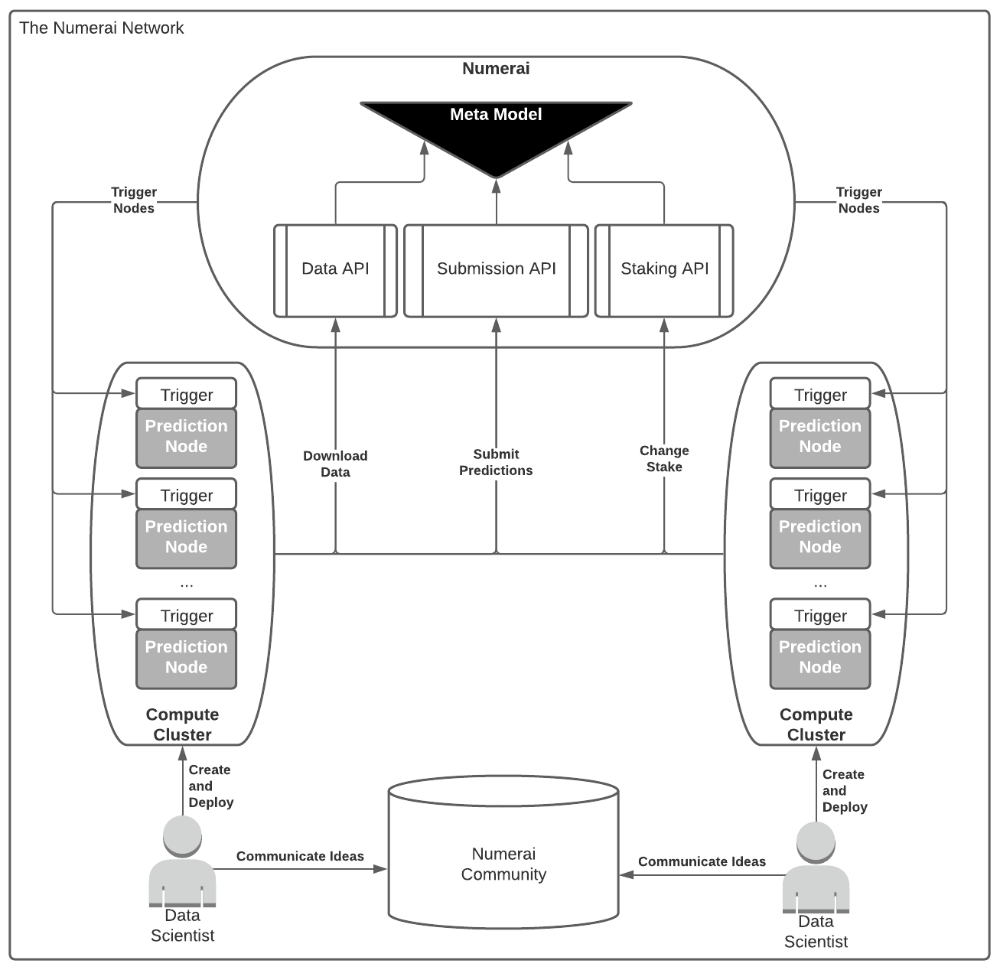

# 予測ファイルの自動提出

Numerai Computeは予測ファイルの提出を自動化できるフレームワークです。Numerai CLI 0.1または0.2を使用している場合は、以下のアップグレードガイドに必ず従ってください。<br>

[numerai-cli](https://github.com/numerai/numerai-cli) は毎週の予測ファイル提出を自動化するのに役立つコマンドラインツールです。本ツールを使用することで、提出期限に遅れることなく予測ファイルを自動で提出できます。<br>


## 始め方

```text
pip3 install numerai-cli

mkdir example-numerai
cd example-numerai

# set up your compute node in AWS
numerai setup

# copy a python example model
numerai docker copy-example

# build the docker container and deploys it to AWS
numerai docker deploy

# trigger your compute node in AWS
numerai compute test-webhook

# watch the logs of the running compute node from AWS
numerai compute logs -f
```

## 自動投稿が有効になる時間

[アカウント設定](https://numer.ai/account)にウェブフックのURLを追加すると、Numeraiは土曜日の19:00 UTC（日本時間で04:00）（ラウンド開始から1時間後）に自動で実行されます。<br>
Numerai-cliを使用せず、独自環境で予測ファイルの自動投稿をしたい場合、本部分を修正してください！<br>
もし、日曜日の2:00 UTC（日本時間で11:00）までに予測ファイルが提出されなかった場合は、警告メールをお送りします。<br>二回目の実行も失敗した場合は、日曜日の19:00 UTC（日本時間で04:00）に再度実行されます。それでも失敗した場合は、月曜日の2:00 UTC（日本時間で11:00）にメールでお知らせします。

## 以下、詳細なセットアップ手順を載せます。

## 引用元



## はじめに

今回の記事では、Numeraiに自動で予測ファイルを提出する[Numerai CLI](https://github.com/numerai/numerai-cli)を紹介します。Numerai CLIとは、Numeraiの予測ファイルを自動で提出できるように支援するパッケージです。

古いwindows\(win8など）を使用している方は、本記事の手順通りにインストール・アクチべートすることをお勧めします。windows10,Linuxユーザーの方はすんなりとインストールできるらしいので、win8にかかわる部分は読み飛ばしてください。

## 目次

1. AWS\(amazon web service\)の設定
2. Numerai APIキーの取得
3. Python・Dockerの設定
4. numerai-cliの使い方 5.numerai computeを使用するまでの手順

## 今回使用する環境

windows8.1 Pro, Intel Core i5 9600K メモリ 32GB

## ①AWS\(amazon web service\)の設定

　AWSはAmazonが運営しているクラウドコンピューティングサービスの一つです。Amazonが持っているCPU/GPUなどをオンラインで使用できるのでタスクの自動化に向いています。Numerai Computeノードをセットアップし、モデルをデプロイするまでを説明します。

1.AWSのアカウントを作成する。  
AWSのアカウントの作成方法は[**本リンク**](https://portal.aws.amazon.com/billing/signup)を参照ください。連絡先情報・クレカの番号が必要となりますが、新規登録者は無料枠の分までは無料です。

2.AWSの請求を有効にする。  
[**AWSの請求を有効**](https://console.aws.amazon.com/billing/home?#/paymentmethods)にし、コードを実行できるようにします。公式曰く、月当たり5USD以下の費用がかかるそうです。

3.IAM ユーザーの事前設定。  
[**IAM**](https://console.aws.amazon.com/billing/home?#/paymentmethods)\(Identity and Access Management\)とはAWS のアクセスを安全に管理するためのウェブサービスのことです。  
アカウント作成時点では、ルート権限を持つユーザーが作成されますが、IAMユーザーの設定をすると、特定の権限を持ったユーザーを作成することができます。今回は、Numeraiに自動で予測を提出するためだけのユーザーを作成します。  
まず、[**本リンク**](https://console.aws.amazon.com/iam/home?region=us-east-1#/policies%24new?step=edit)を開いた後、JSONをクリックしてください。初期時点ではコードが入っていますが削除し、以下のコードをペーストしてください。

\(\*古いNumerai-cliを使用している方は、本部分が以下のコードと違う可能性があります。その場合は、以前のコードを削除し、以下のコードと置換してください。以前のコードのままだと、IAMの権限エラーが出て詰みます。）


```text
{
    "Version": "2012-10-17",
    "Statement": [
        {
            "Sid": "VisualEditor0",
            "Effect": "Allow",
            "Action": [
                "apigateway:*",
                "logs:*",
                "s3:List*",
                "ecs:*",
                "lambda:*",
                "ecr:*",
                "ec2:*",
                "iam:*",
                "batch:*",
                "s3:*"
            ],
            "Resource": "*"
        }
    ]
}
```

次のステップボタン（右下）を**二回**クリックすると、以下の画面になります。


本画面の名前の部分に、任意の名前（例えばcompute-setup-policy）を入れてください。こちらの名前を後で使います。

4.IAM ユーザーの作成  
IAMユーザーの作成を行うために、[**本リンク**](https://console.aws.amazon.com/iam/home?region=us-east-1#/users%24new?step=details)から設定を行います。ユーザー名に先ほど設定した名前（例えばcompute-setup-policy）を入れ、プログラムによるアクセスにチェックを入れた後、次のステップを押してください。


既存のポリシーを直接アタッチを押し、先ほど作成した名前で検索してください。その後、チェックボックスにチェックをいれ、次のステップを**二回**押してください。


入力した後、ユーザーの作成を押せばIAMユーザーの設定は完了です。アクセスキー IDとシークレットアクセスキーが表示されるので、メモしてください。


## ②Numerai APIキーの取得

Numerai APIキーは[設定](https://numer.ai/account)から取得することができます。Create API Keyから   
Upload submissionsにチェックを入れた状態でAPIキーを作成してください。

## ③Python・Dockerの設定

Windowsユーザー向けの設定方法を説明します。 numerai-cliを動かすには、python,dockerが必要です。自動でインストールするスクリプトが用意されているので、windows10を利用されている方は以下のコードを入力してください。

```text
powershell -command "$Script = Invoke-WebRequest 'https://raw.githubusercontent.com/numerai/numerai-cli/master/scripts/setup-win10.ps1'; $ScriptBlock = [ScriptBlock]::Create($Script.Content); Invoke-Command -ScriptBlock $ScriptBlock"
```

このコードがうまく動いた人は以下の手順は不要です。

windows8環境場合は、以下の手順でPython,Docker-toolboxを導入します。  
**特に**Dockerのインストールは多種多様なエラーが出ます。うまくいった例を説明しますが、環境によっては再現しないこともあることをご了承ください。

①Pythonのインストール  
[**こちらのページ**](https://www.python.org/downloads/release/python-392/)からPython 3.9.2をインストールしてください。インストール後はPathを通してください。\(個人によって異なりますが、例えば、C:\Users\USER\AppData\Local\Programs\Python\Python39\Scripts\ をPathに追加してください）


②Docker-toolboxのインストール  
Dockerのインストールは『非常に』エラーが起きやすいです。以下の手順でインストールしてください。

i\)visualboxのインストール  
[**こちらのページ**](https://pythonlinks.python.jp/ja/index.html)から最新版のVisualboxをダウンロードし、インストールしてください。  
ii\)Docker-toolboxのインストール  
[**こちらのページ**](https://github.com/docker/toolbox/releases)からDockerToolbox-18.02.0-ceをダウンロードし、インストールしてください。インストールするときに、Visualboxのチェックを**『絶対に』**外してください。\([**参考文献**](https://cpptake.com/archives/476)\)  
Gitのインストールは同時に行っても問題ありませんので、Gitにチェックを入れてください。  
[](https://camo.qiitausercontent.com/25e351c0ace591b7d05a5b10e6bedfbb7988340e/68747470733a2f2f71696974612d696d6167652d73746f72652e73332e61702d6e6f727468656173742d312e616d617a6f6e6177732e636f6d2f302f313031353731302f63346362636237612d393262372d666330362d326336312d3731333666323764303238662e706e67)

**\(このインストール方法に気が付くまで2日かかりました。Docker-toolboxからvisualboxをインストールすると、Numerai cliを使用できないので、必ずこの手順を守ってください）**

iii\)docker-machineの設定  
**docker quickstart terminal**を起動し、以下のコードを入れてください。

```text
docker run hello-world
```

以下の画像のように表示されればDockerの設定は問題ありません。


次に、Numerai computeで使用するdockerイメージの作成を行います。以下のコードを入力してください。

```text
docker-machine rm default
docker-machine create -d virtualbox --virtualbox-cpu-count=2 --virtualbox-memory=4096 --virtualbox-disk-size=50000 default
```

＊Dockerが見つからない、などのエラーが出た場合は、パスが通っていないので、コントロールパネルからシステムの詳細設定を開き、環境変数→新規を押し、Pathを下図のように設定してください。  
**\(docker toolboxの保存場所は環境によって異なる可能性があります。今回の場合はC:\Program Files\Docker Toolboxでした。）**


＊＊ Docker daemon not running. Make sure you've started "Docker Quickstart Te rminal" and then run this command again. というエラーが出た場合は、次のコードでdefault を再起動してください。

```text
docker-machine restart default
```

それでもエラーが出る場合は、

```text
docker-machine env
```

を入力して出てくる、


```text
eval $("C:\Program Files\Docker Toolbox\docker-machine.exe" env)
```

を入力してください（環境によってこの部分は異なる可能性があります。）

これでdefaultのアクティブ化ができたはずです。（ACTIVEが＊になればOK\)


iv\) pipとnumerai-cliのインストール  
[**こちらのページ**](https://www.python-izm.com/tips/pip/)を参考にpipをインストールしてください。  
pipを入れたら、

```text
pip3 install numerai-cli --user
```

として、numerai-cliをインストールしてください。

## ④numerai-cliの使い方

Docker quick start terminal上で"numerai --help"と打つと、使用できるコマンドリストが取得できます。


numerai copy-example: Numerai運営が用意したexampleファイルをダウンロードできます。

```text
numerai copy-example -e tournament-python3 
numerai copy-example -e signals-python3 
```

などとすることで、Numeraiトーナメント用のexampleファイルや、Signals用のファイルをダウンロードできます。


numerai doctor: numerai-cliの状態を取得します。正常なら、以下のようになります。


numerai list-constants: デフォルトの状態を表示します。


numerai node: DockerFileをAWSにアップロードするためのコマンドです。config, deploy, testをよく使います。


numerai setup: Numerai cliとAPIキーを初期化するコマンドです。記事上部で用意したNumerai public IDやAWSのキーを保存できます。

numerai uninstall: Numerai cliに関連するファイル・AWSの設定などをすべてアンインストールします。

numerai upgrade: .numeraiフォルダにkeyファイルなどを格納します。

## ⑤numerai computeを使用するまでの手順

i\)`numerai setup`を実行し、Numerai public IDやAWSのキーを保存する。  
ii\)`numerai upgrade`を実行し、.numeraiフォルダに必要な情報を移す  
iii\)`numerai copy-example -e tournament-python3` を実行し、tournament-python3フォルダを作成する  
iv\)`cd tournament-python3` として、tournament-python3フォルダに移動する。  
v\)prediction.pyを開き、MODEL\_CONFIGS内のNoneを自分のモデルのUUIDに変更する。  
（UUIDの取得は[こちらから](https://numer.ai/models)\)


vi\)`numerai node -m tit_btcqash_compute config -e tournament-python3 -s mem-md` \(tit\_btcqash\_computeの部分は個人によって異なります。モデル名を入れてください）を実行する。  
（本コードは、tournament-python3フォルダのdockerfileを使用して、mem-mdで構成されたCPU/メモリーをAWSで構成する、というものです）  
vii\)`numerai node deploy` を実行し、AWSに必要情報をアップロードする  
viii\)`numerai node test`を実行し、正常に動作するか確かめる。

i\)~viii\)が実行できればnumerai-computeを使用する準備はできました。  
predict.pyを書き変えて自分のモデルをアップロードしてみましょう。pklファイルなどもpredict.pyと同じフォルダにおいておけば、自動でAWSにアップロードしてくれます。  
なお、新しいモデルをアップロードするときは、

```text
numerai uninstall
```

を実行してからi\)~viii\)の手順を実行するとうまくいくと思います。

## 参考リンク

[Numerai CLI wiki](https://github.com/numerai/numerai-cli/wiki/Amazon-Web-Services)  
[Numerai Computeの設定方法（動画版、英語）](https://www.youtube.com/watch?v=YFgXMpQszpM&ab_channel=Numerai)  
[Numerai CLI tutorial](https://docs.numer.ai/help/compute-tutorial)  
[Numerai CLI　Medium記事](https://medium.com/numerai/building-the-numerai-network-af733c29d56f)  
[Youtube](https://www.youtube.com/watch?v=7NWAlQEay_w&t=2060s&ab_channel=Numerai)

本記事が参考になった方はNMRを投げてくれるとtit\_BTCQASH氏がきっと喜びます。  
 NMR：0x0000000000000000000000000000000000021d96

## Help <a id="getting-started"></a>

ステップバイステップの[チュートリアル](https://docs.numer.ai/help/compute-tutorial)に従うか、[YouTube](https://www.youtube.com/watch?v=YFgXMpQszpM)のビデオをご覧ください。 

[compute rocketchat channel](https://community.numer.ai/channel/compute)で助けを求めてください。

