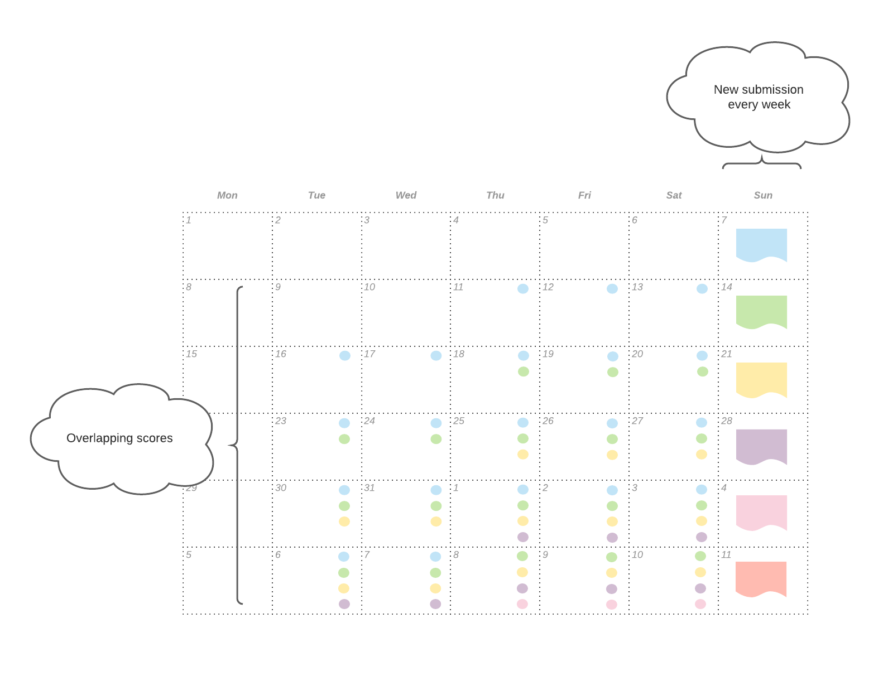

# トーナメント概要

#### 前書き
Numeraiトーナメントでは、難読化されたデータを使用して機械学習モデルを構築することで株式市場の動向を予測します。<br>
提出した予測ファイルにNMRと呼ばれる暗号通貨を賭けると、パフォーマンスに基づいてNMRを獲得できます。<br>
Numeraiに提出された予測ファイルは、Numeraiが保有するヘッジファンドのモデル（メタモデル）を設計するために使用されます。下に示すyoutubeを見ることで、どのようにデータが使用されるか学べます。<br>

[](https://www.youtube.com/watch?v=dhJnt0N497c)<br>

#### 概要
1.Numeraiに[登録](https://numer.ai/)する。<br>
2.トレーニングデータとサンプルスクリプトを含むデータセットをダウンロードする。<br>
3.モデルを作成し、予測をNumeraiに送信する。<br>
4.モデルにNMRを賭けて、パフォーマンスに基づいてNMRを貰う/払う<br>
6.毎週の提出物を自動化する。<br>

## データ
Numeraiトーナメントの中核は無料のデータセットが使用できることです。データセットはクリーンアップ・正規化・難読化された高品質の財務データで構成されています。<br>


提供されている`training_data`では、各`id`は難読化された`features`のセットを持つ株式に対応しています。<br>
`target`は将来のパフォーマンスを表します。行は、異なる時点を表す`eras`にグループ化されています。<br>
詳細は[本記事](https://qiita.com/tit_BTCQASH/items/366a2d1c273507dd4b8c)に詳しく記述されています。<br>

## モデリング
Numeraiトーナメントでは、過去のデータを用いて予測モデルを作成し、そのモデルを用いて将来の株式市場を予測することが目的です。<br>
PythonでXGBoostを使用した基本的な例を次に示します。<br>
過去のトレーニングデータを使用してモデルをトレーニングし、ライブトーナメントデータで予測を行います。<br>
（＊本プログラムのみでは予測ファイルの提出ができません。より実践的な例は[本記事](https://qiita.com/tit_BTCQASH/items/366a2d1c273507dd4b8c)をチェックしてください。

```python
import pandas as pd
from xgboost import XGBRegressor

# training data contains features and targets
training_data = pd.read_csv("numerai_training_data.csv").set_index("id")

# tournament data contains features only
tournament_data = pd.read_csv("numerai_tournament_data.csv").set_index("id")
feature_names = [f for f in training_data.columns if "feature" in f]

# train a model to make predictions on tournament data
model = XGBRegressor(max_depth=5, learning_rate=0.01, \
                     n_estimators=2000, colsample_bytree=0.1)
model.fit(training_data[feature_names], training_data["target"])

# submit predictions to numer.ai
predictions = model.predict(tournament_data[feature_names])
predictions.to_csv("predictions.csv")
```

## 予測ファイルの提出

毎週土曜日の`18:00 UTC`\(日本時間では日曜日`03:00 JST`\) に新しいラウンドが始まり、新しいトーナメントデータが公開されます。トーナメントデータを用いて予測値の入ったファイルを作成し、Numeraiに提出しましょう！<br>

締め切りは月曜日`14:30 UTC` \(日本時間では月曜日`23:30 JST`\) です。提出が遅れた場合、ペイアウトの対象外となります。<br>
[Numerapi](https://github.com/uuazed/numerapi) や[Rnumerai](https://github.com/Omni-Analytics-Group/Rnumerai)GraphQL [API](https://api-tournament.numer.ai/) を使用することもできます。<br>
以下は、コードの例です。
```python
import numerapi
napi = numerapi.NumerAPI("public_id", "secret_key")

# download data
napi.download_current_dataset(unzip=True)

# upload predictions
napi.upload_predictions("predictions.csv", model_id="model_id")
```
また、[Numerai-cli](https://github.com/numerai/numerai-cli) を用いて毎週の予測ファイル提出を自動化することもできます。<br>

```python
# setup your cloud infrastructure
numerai setup

# copy the example model
numerai docker copy-example

# deploy the example model 
numerai docker deploy
```


## モデルパフォーマンスの診断
モデルパフォーマンスは`DIAGNOSTICS`に示される指標を用いて診断することができます。過去のデータから提出した予測ファイルのパフォーマンス・リスクを評価する指標が表示されます。<br>

この評価ツールを繰り返し使用すると、すぐにオーバーフィットします。本ツールは、最終チェックとして使用するのが望ましいです。<br>


詳細についてはこの[フォーラム投稿](https://forum.numer.ai/t/model-diagnostics-update/902)を読んでください。<br>


## モデルの評価方法

あなたが提出した予測結果は、あなたの予測と真のターゲットの `correlation` \(ここではspearmanの順位相関\)でスコアリングされます。相関性が高いほど高いペイアウトを得られます。<br>



```python
# method='first' breaks ties based on order in array
ranked_predictions = predictions.rank(pct=True, method="first")
correlation = np.corrcoef(labels, ranked_predictions)[0, 1]
```



予測結果は、メタモデルへの寄与（mmc)と機能の中立的な相関(fnc)についてもスコアが付けられます。<br>
各提出物は、トーナメントが開始してから4週間にわたって評価されます。締め切り後の木曜日に最初の評価を受け取り、4週間後の水曜日に最終スコアを受け取ることができます。合計で20スコアの加重平均値がペイアウトされるNMRの量を決定します。<br>


トーナメントが終了するまでには約4週間かかるため、毎週新しい予測ファイルを提出すると、進行中の4つのラウンドから各スコアリング日に複数（最大4）の評価を受け取ります。


モデルのライブスコアは、プロフィールページで公開されています。これは、過去20ラウンドにわたるモデルの最終スコアの例です。


特定のラウンドにズームインして、ラウンド内の毎日のスコアを確認することもできます。


## Staking and Payouts

あなたの予測結果に `stake` することで `payouts` を得ることができます。`corr` のみ、または `corr + mmc` にstake することができます。

stake せずにNumeraiに参加することで、トーナメントの詳細や自分のモデルの性能を知ることができます。自分のモデルに自信が持てるようになったら、そのモデルにstake することができます。stake の最小値は0.01NMRです。


ステイキングを行うには、[Erasure](https://erasure.world/) smart contract agreement で [NMR](https://coinmarketcap.com/currencies/numeraire/) をロックする必要があります。これにより、モデルのパフォーマンスが低下した場合、Numerai はあなたのstake を燃やすことができます。


あなたがstake しているスコアに基づいて、あなたのstake のパーセンテージを `earn` \(獲得\)したり、 `burn` \(燃やし\)たりします。例えば、`correlation` に `100NMR` をstake して、スコアが+0.05だった場合、100NMRの5%=5NMRを獲得できます。稼ぐか燃やすかの上限は、1ラウンドごとにstake の `25％` となります。

```python
corr_payout = stake * clip(corr, -0.25, 0.25)

mmc_payout = stake * clip(corr + mmc, -0.25, 0.25)
```

詳しくは [Staking and Payouts](https://jp.docs.numer.ai/numerai-tournament/staking-and-payouts) のセクションを見てください。

## Daily Updates

提出した予測結果はそれぞれ、投稿締め切り後の最初の木曜日から4週間後の水曜日まで、毎日更新されたスコアを受け取ることができます。例えば、`7日（日）`に青の投稿をした場合、最初のスコアは`11日（木）`、最終スコアは翌月の`7日（水）`に届きます。

提出した予測結果にstake した場合、ペイアウトも毎日更新されます。しかし、最終的なスコアと最終的なペイアウトだけがカウントされます。


## Reputation and Leaderboard

リーダーボードでのあなたの `rank` は、過去20ラウンドの `correlation` スコアの加重平均である `reputation` に基づいています。

詳しくは、 [Reputation](https://jp.docs.numer.ai/numerai-tournament/reputation) のセクションを参照してください。


## Support

助けが必要ですか？

質問、サポート、フィードバックのために [RocketChat](https://community.numer.ai/home) で私たちを見つけてください!

