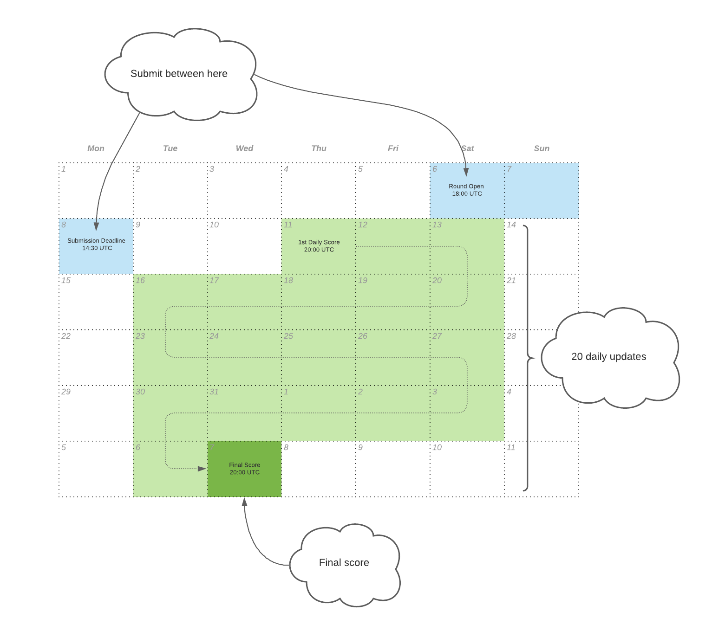
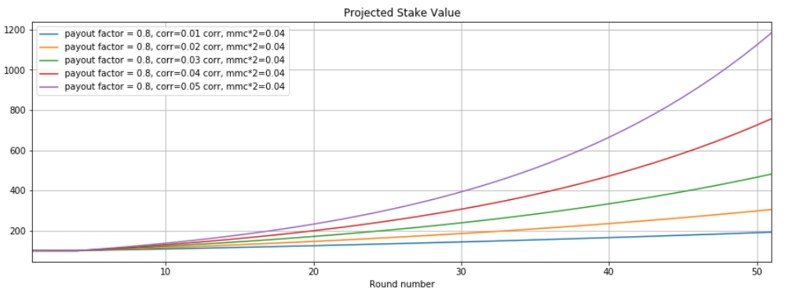

# Tournament概要

#### 前書き
NumeraiTournamentとは、株式市場の動向を予測し、競争するプラットフォームです。<br>
<br>
参加者は難読化されたデータを使用して機械学習モデルを構築し、予測ファイルを提出することでTournamentに参加できます。<br>
<br>
また、提出した予測ファイルにNMRと呼ばれる暗号通貨を賭けると、パフォーマンスに基づいてNMRを獲得できます。<br>
<br>
Numeraiに提出された予測ファイルは、Numeraiが保有するヘッジファンドのモデル（メタモデル）を設計するために使用されます。下に示すyoutubeを見ることで、どのようにデータが使用されるか学べます。<br>

[](https://www.youtube.com/watch?v=dhJnt0N497c)<br>

#### 概要
1.Numeraiに[登録](https://numer.ai/)する。<br>
2.トレーニングデータとサンプルスクリプトを含むデータセットをダウンロードする。<br>
3.モデルを作成し、予測をNumeraiに送信する。<br>
4.モデルにNMRを賭けて、パフォーマンスに基づいてNMRを貰う/払う<br>
6.毎週の提出物を自動化する。<br>

## データ
NumeraiTournamentの中核は無料のデータセットが使用できることです。データセットはクリーンアップ・正規化・難読化された高品質の財務データで構成されています。<br>


提供されている`training_data`では、各`id`は難読化された`features`のセットを持つ株式に対応しています。<br>
`target`は将来のパフォーマンスを表します。行は、異なる時点を表す`eras`にグループ化されています。<br>
詳細は[本記事](https://qiita.com/tit_BTCQASH/items/366a2d1c273507dd4b8c)に詳しく記述されています。<br>

## モデリング
NumeraiTournamentでは、過去のデータを用いて予測モデルを作成し、そのモデルを用いて将来の株式市場を予測することが目的です。<br>
<br>
PythonでXGBoostを使用した基本的な例を次に示します。<br>
過去のトレーニングデータを使用してモデルをトレーニングし、ライブTournamentデータで予測を行います。<br>
（＊本プログラムのみでは予測ファイルの提出ができません。より実践的な例は[本記事](https://qiita.com/tit_BTCQASH/items/366a2d1c273507dd4b8c)をチェックしてください。

```python
import pandas as pd
from xgboost import XGBRegressor

# training data contains features and targets
training_data = pd.read_csv("numerai_training_data.csv").set_index("id")

# tournament data contains features only
tournament_data = pd.read_csv("numerai_tournament_data.csv").set_index("id")
feature_names = [f for f in training_data.columns if "feature" in f]

# train a model to make predictions on tournament data
model = XGBRegressor(max_depth=5, learning_rate=0.01, \
                     n_estimators=2000, colsample_bytree=0.1)
model.fit(training_data[feature_names], training_data["target"])

# submit predictions to numer.ai
predictions = model.predict(tournament_data[feature_names])
predictions.to_csv("predictions.csv")
```

## 予測ファイルの提出

毎週土曜日の`18:00 UTC`\(日本時間では日曜日`03:00 JST`\) に新しいラウンドが始まり、新しいTournamentデータが公開されます。Tournamentデータを用いて予測値の入ったファイルを作成し、Numeraiに提出しましょう！<br>

締め切りは月曜日`14:30 UTC` \(日本時間では月曜日`23:30 JST`\) です。提出が遅れた場合、ペイアウトの対象外となります。<br>
[Numerapi](https://github.com/uuazed/numerapi) や[Rnumerai](https://github.com/Omni-Analytics-Group/Rnumerai)GraphQL [API](https://api-tournament.numer.ai/) を使用することもできます。<br>
以下は、コードの例です。
```python
import numerapi
napi = numerapi.NumerAPI("public_id", "secret_key")

# download data
napi.download_current_dataset(unzip=True)

# upload predictions
napi.upload_predictions("predictions.csv", model_id="model_id")
```
また、[Numerai-cli](https://github.com/numerai/numerai-cli) を用いて毎週の予測ファイル提出を自動化することもできます。<br>

```python
# setup your cloud infrastructure
numerai setup

# copy the example model
numerai docker copy-example

# deploy the example model 
numerai docker deploy
```


## モデルパフォーマンスの診断
モデルパフォーマンスは`DIAGNOSTICS`に示される指標を用いて診断することができます。過去のデータから提出した予測ファイルのパフォーマンス・リスクを評価する指標が表示されます。<br>
<br>

この評価ツールを繰り返し使用すると、すぐにオーバーフィットします。本ツールは、最終チェックとして使用するのが望ましいです。<br>


詳細についてはこの[フォーラム投稿](https://forum.numer.ai/t/model-diagnostics-update/902)を読んでください。<br>


## モデルの評価方法

あなたが提出した予測結果は、あなたの予測と真のターゲットの `correlation` \(ここではspearmanの順位相関\)でスコアリングされます。相関性が高いほど高いペイアウトを得られます。<br>



```python
# method='first' breaks ties based on order in array
ranked_predictions = predictions.rank(pct=True, method="first")
correlation = np.corrcoef(labels, ranked_predictions)[0, 1]
```



予測結果は、メタモデルへの寄与（mmc)と機能の中立的な相関(fnc)についてもスコアが付けられます。<br>
<br>
各提出物は、Tournamentが開始してから4週間にわたって評価されます。締め切り後の木曜日に最初の評価を受け取り、4週間後の水曜日に最終スコアを受け取ることができます。合計で20スコアの加重平均値がペイアウトされるNMRの量を決定します。<br>


Tournamentが終了するまでには約4週間かかるため、毎週新しい予測ファイルを提出すると、進行中の4つのラウンドから各スコアリング日に複数（最大4）の評価を受け取ります。


モデルのライブスコアは、プロフィールページで公開されています。これは、過去20ラウンドにわたるモデルの最終スコアの例です。


特定のラウンドにズームインして、ラウンド内の毎日のスコアを確認することもできます。


# ステーキングとペイアウト

## モチベーション

[シビル攻撃](https://en.wikipedia.org/wiki/Sybil_attack)などのNumeraiにとって不都合な攻撃を防止しつつNMRをペイアウトするにはどのようなシステムを設計すればよいでしょうか？<br>
<br>
その答えはステーキング(=預け入れ)です。各参加者はNMRを掛け金として自分の予測の正確さを担保します。NMRのステーク量が多ければ多いほど予測に自信をもっているとみなします。<br>
<br>
Numeraiは正確な予測ファイルの提出を望んでおり、良い予測には高い報酬で報います。<br>
<br>
どれだけのNMRを得られるかはNMRのステーク量と、Corr,MMCの値に依存します。<br>
これは、[Skin in the Game](https://www.amazon.com/dp/B075HYVP7C/)という本で述べられているメゾットを使用しています。<br>
<br>
NumeraiにNMRをステーキングする場合、Numeraiはシビル耐性のある方法を提供します。NMRのペイアウトはステーク量に比例するため、複数のアカウントを作成するだけでは多くのペイアウト得ることができません。<br>
<br>
もちろん、NMRをステークせずにNumeraiに参加することもできます。<br>
例えば、Tournamentの詳細や自分のモデルの性能を知るために、NMRをステークしないのは良いテストとなるでしょう。<br>
自分のモデルに自信が持てるようになったら、そのモデルにステークすることができます。ステークの最小値は3NMRです。<br>

## ステーク量の変更方法

Numeraiのウェブサイトでは、「Manage Stake」をクリックしてステーク量を管理できます。このモーダルを使用すれば、NMRのステーク量を増減したり、`Corr`、`Corr+1/2MMC`、`Corr+MMC`、`Corr+2MMC`にベットできます。<br>
<br>
ステーキングとは、NMRをイーサリアムブロックチェーンのスマートコントラクトに固定することを意味します。ステーク中はNumeraiがロックアップされたNMRを増減させる権利を保有します。<br>
<br>


NMRのステーク量を増やすと、あなたのウォレットからNMRが引き出され、Numeraiの保有しているアカウントにNMRが移送されます。<br>
NMRのステーク量を減らすと、Numeraiの保有しているアカウントからNMRが移送され、あなたのウォレットに入金されます。

ステーク量への変更はすぐに適用されるのではなく、約4週間後に反映されます。これは、Tournamentの終了期間が4週間であることに起因します。

## ペイアウト
どれだけのNMRを得られるかはNMRのステーク量と、Corr,MMCの値に依存します。<br>
<br>
スコアが高いほど、より多くのNMRを得ることができます。もし負のCorr,MMCとなった場合、ステークしたNMRの一部が没収され、バーンされます。<br>
バーンとはERC-20トークンの持つ機能の一つであり、トークンを永遠に使用できなくする操作のことです。<br>
ペイアウトされるNMRの量はステークした量の±25％に制限されています。<br>
<br>
ペイアウトは以下の式で計算されます。<br>
<br>
payout = stake_value * payout_factor * (corr * corr_multiplier + mmc * mmc_multiplier)<br>
<br>
stake_value:ラウンド開始時点の最初の木曜日にステークしたNMRの量<br>
payout_factor:30万NMR以下では1、30万NMR以上では以下の図に示す値をとります。Numeraiはペイアウトの上限を決めることで持続的なTournamentの開催を行うことができます。<br>
<br>

corr:提出した予測ファイルとターゲットの相関<br>
corr_multiplier:現在は1のみ<br>
mmc:提出した予測ファイルとメタモデルの相関<br>
mmc_multiplier:0,0.5,1,2の中で一つ選べる。<br>
<br>
ペイアウトファクターの関数やマルチプライヤーは、Numeraiによって変更される可能性があります。<br>
<br>
ペイアウト計算の例を下図に示します。<br>
最初の2つの例は、`corr_multiplier`の影響を示しています。<br>
3番目の例は、負のスコアがペイアウトに影響を与えるかを示しています。<br>
4番目の例は、ペイアウトがステーク量の±25％に制限されていることを示しています。<br>

<br>

スコアは毎日更新されますが、ペイアウトはTournamentの終了日（日本時間の木曜日）にのみ行われます。参加者の一人が作成したNumeraiPayoutsアプリを使用すると、毎日の変化を追跡できます。<br>
<br>
ステークを開始すると、最初の4ラウンドの間ステーク値は一定に保たれます。その後、4週間前のラウンドの支払いに基づいて、ステーク値が毎週更新されます。<br>


提出した予測ファイルがプラスのCorr、MMCを持ち続ける限り、得られたNMRの量は増大します。モデルが52週間、毎週同じ正のスコアを取得すると仮定した場合の支払い予測の例を下図に示します。<br>



## 濫用防止

Numeraiは、積極的にペイアウトルールを悪用している、または悪用していると判断した場合には、賭け金を払い戻し、すべての得られたNMRを無効化にする権利を保有します。

Numeraiの支払いシステムは攻撃に強いように設計されています。ユーザーが罰を恐れずに新しいアイデアを試してもらいたいため、この権利を行使することはめったにありません。

悪質な攻撃を発見した場合には、そのことをコミュニティに伝えてください。以前あった攻撃の一つが[こちら](https://forum.numer.ai/t/leaderboard-bonus-exploit-uncovered/200/8)で紹介されています。


## リーダーボード
NMRのペイアウトはラウンドごとのパフォーマンスに左右されます。リーダーボードに掲載される評価や順位は20ラウンド分のCorr,MMCの加重平均値を用いています。<br>
詳しくは、 [Reputation](https://jp.docs.numer.ai/numerai-tournament/reputation) のセクションを参照してください。<br>


## サポート

助けが必要ですか？<br>

質問、サポート、フィードバックは [RocketChat](https://community.numer.ai/home) にお願いします!<br>

